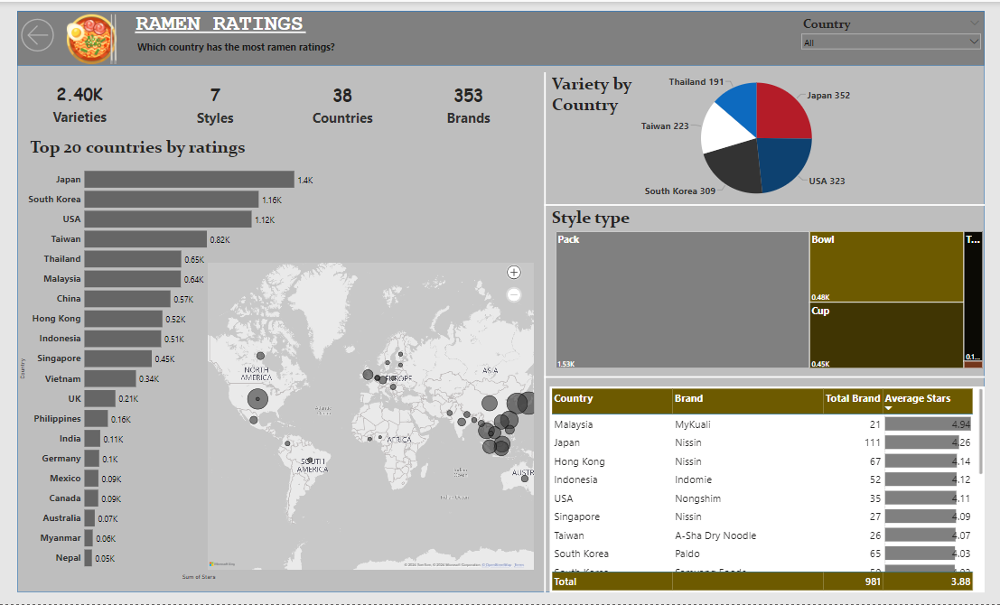

# Ramen-Rating

# Ramen-Rating Analysis

---

## Introduction
The Ramen Rater is a product review website for the hardcore ramen enthusiast (or "ramenphile"), with over 2500 reviews to date. This dataset is an export of "The Big List" (of reviews), converted to a CSV format.

## Problem Statement
1.	What country has the highest total rating?
2.	How are the varities amongst each countries?
3.	What styling was most sort after?

## Data Source
This data was gotten from Kaggle. Here is the (link) https://www.kaggle.com/datasets/residentmario/ramen-ratings/data.

It contains one csv file with 2578 records.

## Data Cleaning
Data was transformed using power query editor.Irrelevant columns were removed and empty rows were also removed.

## Data Visualization
The analysis was a dashboard.

## Ramen Rating dashboard

---

## Insights
It was gathered that the country with the highest reviews was japan, and it also safe to say that ramen is a dish particularly common in Asia as depicted in our data. Japan aslo has a lot of variety when it comes to ramen.
The most prefered styling for the ramen was Pack. Mykauli brand had the highest average rating, and it also was dominant in Malaysia even thou it had a least amount of total brand when compared to Nissin which was also dominant in Japan as well as other countries with a total brand number of 111.
